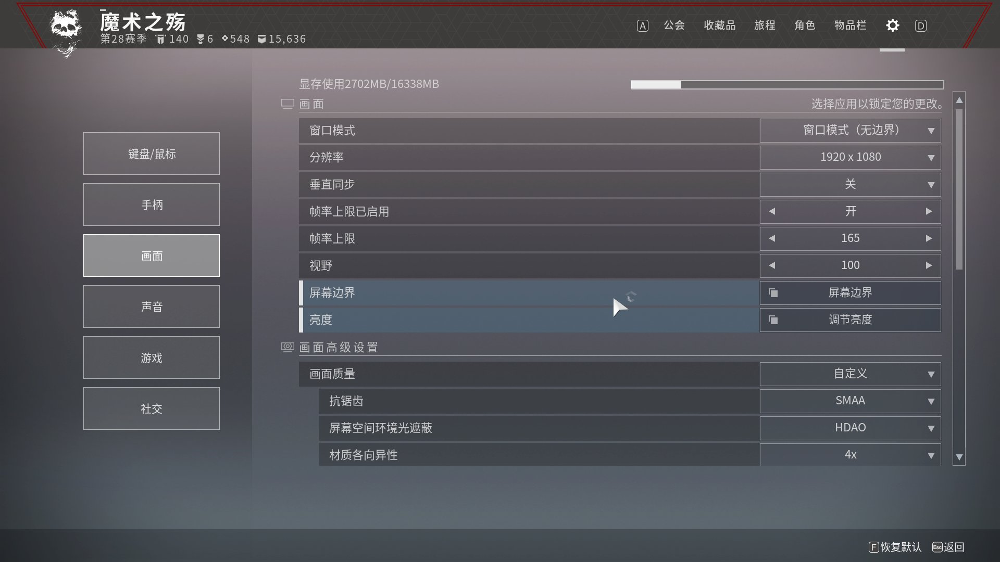
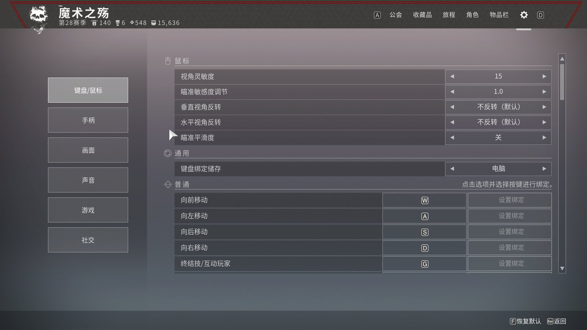
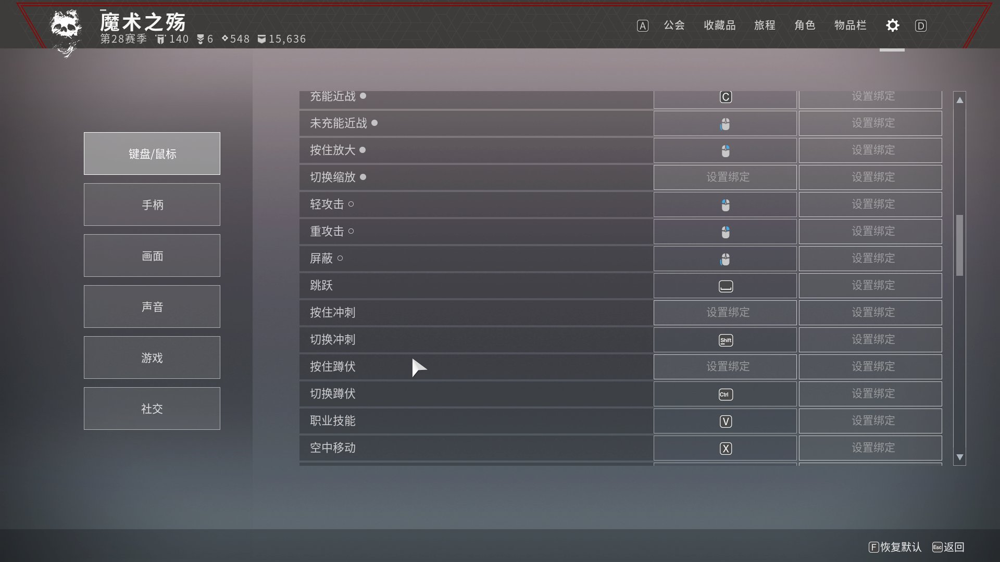

# d2-ogre-kick

基于溜溜球99九九的 [B站视频 BV1x5Ki6cE8r](https://www.bilibili.com/video/BV1x5Ki6cE8r) 手法实现的棱镜虚空猎自动踢Boss脚本（近战版）。

> 战争领主的废墟首Boss（拉希尔 / Rathil）自动化踢杀，使用虚空超能聚怪 + **近战**进终结的套路。

## 原理

| 阶段 | 操作 | 说明 |
|------|------|------|
| 1 | 飞升前走位 | W/A定位 → E插旗 → E吃旗 → 2切武器 → 冲刺走位 → 跳（严格按 .rec 录制回放） |
| 2 | 飞升分身 | X (Ascension) 留下克隆体吸引Boss仇恨 |
| 3 | S后退定位 | 飞升后 S×2 后退寻找输出位置 |
| 4 | ① ADS+近战 | 右键开镜瞄准 + C 近战拉怪 |
| 5 | ② 超能瞄准 | 第二次瞄准调正方向 |
| 6 | F 虚空超能 | Shadowshot: Deadfall 聚怪 |
| 7 | 冲刺终结 | A→W→SHIFT 冲刺 + G 终结技踢Boss |

## 环境

- Python 3.11 ~ 3.13
- Windows 10/11
- 屏幕分辨率 1920×1080
- 依赖：`pydirectinput`、`loguru`、`Pillow`（见 `requirements.txt`）

## 游戏内必设项

> ⚠️ 脚本对游戏内设置极其敏感，**只要任何一项不一致，鼠标偏移和时序就会全部跑偏**，必须严格按下方设置。

### 1. 画面设置



| 项 | 值 |
|---|---|
| 分辨率 | **1920 × 1080** |
| 窗口模式 | 窗口模式（无边界） |
| 帧率上限 | 165（启用帧率上限） |
| 视野 | **100** |
| 抗锯齿 | SMAA |
| 屏幕空间环境光遮蔽 | HDAO |

### 2. 键盘/鼠标设置 — 鼠标灵敏度



| 项 | 值 |
|---|---|
| 视角灵敏度 | **15** |
| 瞄准灵敏度调节 | **1.0** |
| 垂直/水平视角反转 | 不反转（默认） |
| 瞄准平滑度 | 关 |

### 3. 键盘绑定 ⚠️ 关键



| 项 | 键 | 必设原因 |
|---|---|---|
| 向前/后/左/右移动 | W / S / A / D | 走位 |
| 充能近战 | **C** | 终结前置 |
| 跳跃 | Space | 飞升前跳跃 |
| 空中移动 | **X** | 飞升 |
| 终结技/互动玩家 | **G** | 终结 |
| 视角灵敏度 | 15 | — |
| ⚠️ **切换冲刺** | **Shift** | **必须设成"切换冲刺"，不能是"按住冲刺"！脚本 send Shift=按下立刻松开触发冲刺** |

> **重点：按住冲刺 必须保持空（"设置绑定"），把切换冲刺设成 Shift。**
> 否则脚本按下 Shift 时会触发"按住冲刺"模式，等脚本松开 Shift 又会把冲刺关掉，节奏完全错乱。

### 4. 设置界面本身的设置

进入游戏 → 按 **Esc** → **齿轮图标（设置）** → **键盘/鼠标** / **画面**。

---

## 安装

```bash
pip install -r requirements.txt
```

## 配置

编辑 `settings.toml`：

1. **[base]** — 按键绑定，按你在游戏里的设置修改
2. **[1080p]** — 鼠标偏移量与时序参数，基于录制数据校准
3. 所有参数都可通过 `src/tuner.py` 在运行时用热键微调（F2/F3/F5/F6 增减，F1 显示当前值）

## 运行

双击 `start.bat`，或：

```bash
cd d2-ogre-kick
python src/run.py
```

按 `Ctrl+C` 停止。

## 调试

- 在 `settings.toml` 中设置 `debug = true`，脚本会在 `./debug/` 目录保存每次检测的截图，方便校准参数
- 录制输入回放：使用 `src/record.py` 录制自己的 .rec 文件解析鼠标/键盘时间戳

## 注意事项

- 需要配装棱镜虚空猎 + 飞升星相 + 近战武器（取消枪的射击）
- Boss 两腿之间射箭 → 小怪聚拢 → **近战**触发终结血量 → 直冲终结
- 冲之前不要下台阶，否则 Boss 会提前抬脚
- 首次运行会先重置一次进度，确保在正确的出生点
- `.rec` 录制文件不会被 git 跟踪（见 `.gitignore`）
